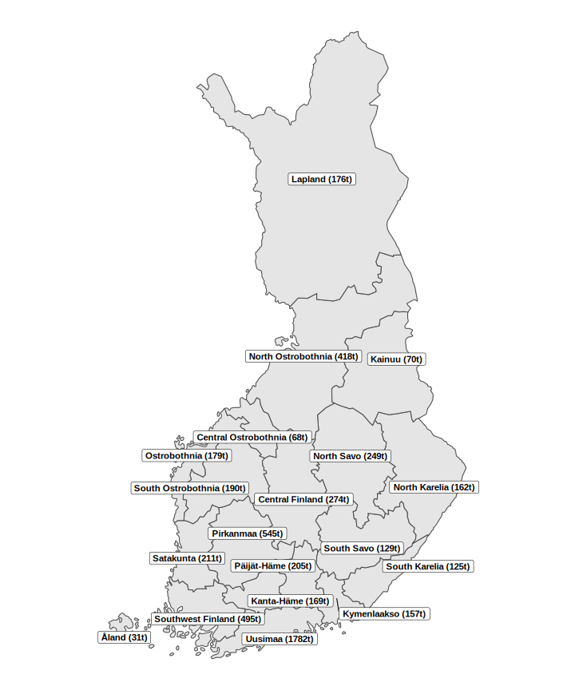

## bayesPop data for Finland

Subnational data on total fertility rate, life expectancy at birth, migration and population for Finnish regions to be used for subnational probabilistic projections of fertility, mortality, migration and population. These files are regional level (n = 19), derived from Statistics Finland.  
Data downloaded on **14 December 2025**.

| File | StatFin source | Notes |
|------|----------------|-------|
| popF, popM | [11re — Population according to age (1-year) and sex by area, 1972–2024](https://pxdata.stat.fi/PxWeb/pxweb/en/StatFin/StatFin__vaerak/statfin_vaerak_pxt_11re.px/) | Municipality data aggregated to regional level. Population as of 31.12. |
| mig_rates, mig_counts | [11ae — Vital statistics and population by area, 1990–2024](https://pxdata.stat.fi/PxWeb/pxweb/en/StatFin/StatFin__muutl/statfin_muutl_pxt_11ae.px/) | Municipality data aggregated to regional level |
| e0F, e0M | [12an — Life expectancy at birth by sex and region, 1990–1992–2022–2024](https://pxdata.stat.fi/PxWeb/pxweb/en/StatFin/StatFin__kuol/statfin_kuol_pxt_12an.px/) | Rolling three-year averages |
| MxF, MxM | e0F, e0M | Generated from e₀ using [generateMx.R](https://github.com/PPgp/CSDE2025workshop/blob/main/data/generate_mx.R) |
| tfr | [12du — Total fertility rate and gross reproduction rate by region, 1990–2024](https://pxdata.stat.fi/PxWeb/pxweb/en/StatFin/StatFin__synt/statfin_synt_pxt_12du.px/) | |
| pasfr | [12dq — Live births by sex, age of mother (5-year) and area, 1990–2024](https://pxdata.stat.fi/PxWeb/pxweb/en/StatFin/StatFin__synt/statfin_synt_pxt_12dq.px/) | Calculated from 5-year age groups, using monotone spline in [DemoTools package](https://timriffe.github.io/DemoTools/articles/graduation_with_demotools.html) |
| migrationF, migrationM | [11a2 — Internal migration by age (5-year), sex and area, 1990–2024](https://pxdata.stat.fi/PxWeb/pxweb/fi/StatFin/StatFin__muutl/statfin_muutl_pxt_11a2.px/)  [11a7 — International migration by age (5-year) and sex, 1990–2024](https://pxdata.stat.fi/PxWeb/pxweb/fi/StatFin/StatFin__muutl/statfin_muutl_pxt_11a7.px/)| Age- and sex-specific net migration. From 5-year age groups, as of now assuming dividing the numbers equally within age intervals |
| StatFin_forecast | [14wx -- Population projection 2024: Population according to age and sex by area, 2024-2045](https://pxdata.stat.fi/PxWeb/pxweb/en/StatFin/StatFin__vaenn/statfin_vaenn_pxt_14wx.px/) | Statistics Finland municipality level population forecast 2024, aggregated to regional level. Not needed but saved in case of users want to compare their forecasts to official forecasts |

**Regions of Finland and their population on 31.12.2024

